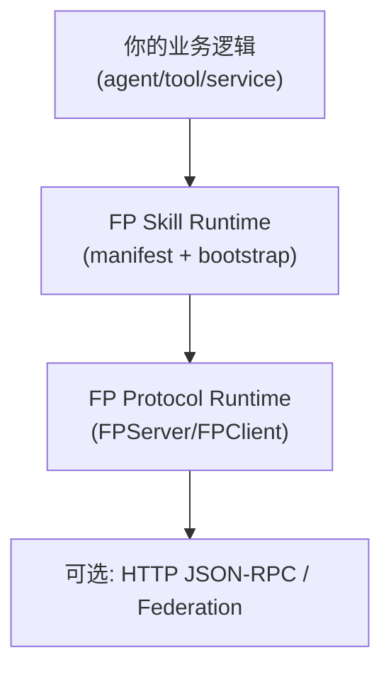
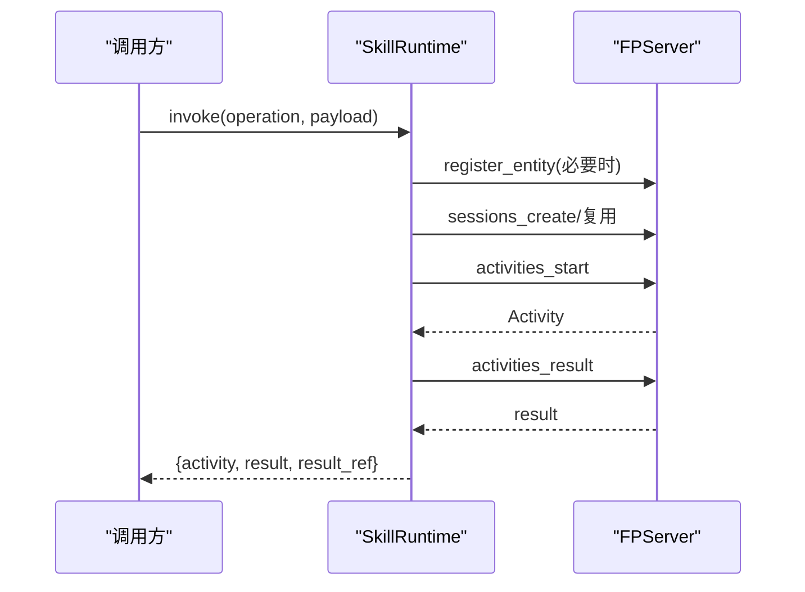

# FP Skill 轻量接入与部署指南（中文）

这份文档讲一件事：如何把“已有 agent/tool/service”通过 Skill 快速接入 FP，而不是手写大量协议胶水代码。

---

## 1. Skill 在架构中的位置



核心原则：

- Skill 是接入层，负责“自动化接线”。
- FP core 仍是协议语义来源。
- Skill 不反向侵入 FP core。

---

## 2. 最小接入步骤

### 第一步：写 manifest（声明实体与操作）

示例：`skills/examples/weather.skill.json`

关键字段：

- `entity`: 你的实体是谁（id/kind/capabilities）
- `connection`: 如何连接 FP（`inproc` 或 `http_jsonrpc`）
- `auth`: 认证来源（none/bearer_env/bearer_static）
- `defaults`: auto session、policy、budget
- `operations`: operation 名称到 handler 引用的映射

### 第二步：实现 handler

示例：`skills/examples/weather_handlers.py`

```python
from fp_skill.decorators import fp_operation

@fp_operation("weather.lookup")
def lookup_weather(payload: dict[str, object]) -> dict[str, object]:
    city = str(payload.get("city", "unknown"))
    return {"city": city, "condition": "sunny", "temp_c": 22}
```

### 第三步：校验 manifest

```bash
PYTHONPATH=src:skills/python python3 -m fp_skill validate skills/examples/weather.skill.json
```

### 第四步：本地 smoke 运行

```bash
PYTHONPATH=src:skills/python python3 -m fp_skill smoke skills/examples/weather.skill.json \
  --operation weather.lookup --payload '{"city":"Paris"}' \
  --idempotency-key idem-weather-paris-001
```

---

## 3. SkillRuntime 自动帮你做了什么

`SkillRuntime` 在一次 `invoke` 里自动串起来：

1. 注册实体（manifest entity + orchestrator）
2. 加载并注册 operation handler
3. 自动创建/复用 session（当 `auto_session=true`）
4. 调用 `activities_start`
5. 返回 `activities_result`



---

## 4. 幂等语义（重要）

当前版本是**显式幂等**：

- 你不传 `idempotency_key`：每次调用都会产生新 activity。
- 你传稳定 key：同请求可重试复用。
- 同 key 但请求指纹不同：会冲突（防止误重放）。

建议：

- 所有可能重试的调用都显式传 `idempotency_key`。
- key 由调用方业务侧生成并持久化，而不是每次随机生成。

---

## 5. 从本地到部署的路径

### 阶段 A：本地 inproc

- `connection.mode = inproc`
- 无需外部服务
- 最快验证语义

### 阶段 B：远端 HTTP JSON-RPC

- `connection.mode = http_jsonrpc`
- 配置 `rpc_url`
- `auth.mode` 推荐 `bearer_env`

### 阶段 C：联邦发布（可被全网寻址）

- 用 FP 运行时发布 well-known card
- 目录服务维护 TTL/ACL/health
- 其他实体按 `entity_id` 发现并连接


---

## 6. 推荐生产实践

1. 使用 `bearer_env`，不要把 token 写死在仓库。  
2. 所有可重试业务调用传显式 idempotency key。  
3. 开启合理 `token_limit`，避免预算失控。  
4. 对高价值操作设置 `policy_ref`，并结合 provenance 审计。  
5. 先通过 `fp_skill smoke`，再接入真实流量。

---

## 7. 常见问题

### Q1: 我的框架不是 Python，怎么用？

A：先复用 `skills/spec/manifest.schema.json`。Skill 的“描述层”是语言无关的。后续可实现 TS/Go 版本 runtime。

### Q2: handler 为什么是 `module:function`？

A：v0.1 优先保证可验证和低歧义。类方法/可调用对象可在后续版本扩展。

### Q3: Skill 会不会绑死 FP core？

A：不会。依赖方向是 `skills -> fp`，核心协议不依赖 skill，后续可独立拆仓。

---

## 8. 你现在可以直接复制的命令

```bash
# 1) 校验 manifest
PYTHONPATH=src:skills/python python3 -m fp_skill validate skills/examples/weather.skill.json

# 2) 运行 smoke
PYTHONPATH=src:skills/python python3 -m fp_skill smoke skills/examples/weather.skill.json \
  --operation weather.lookup --payload '{"city":"Paris"}' \
  --idempotency-key idem-weather-paris-001
```

做到这两步，说明你的实体已经具备“低成本接入 FP”的最小能力。
