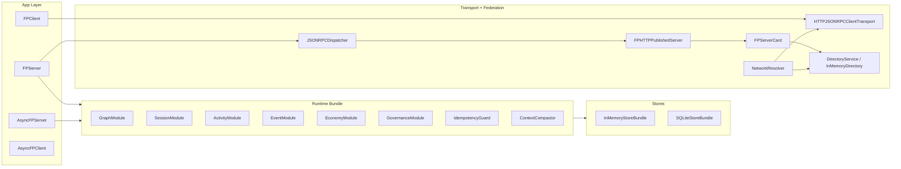

# FP Codebase Guide (PPT-Ready)

This page is intentionally detailed. It is designed as a complete source for generating technical slides, architecture diagrams, and implementation walkthroughs.

## 1) What FP is

Foundation Protocol (FP) is a graph-first control plane for multi-entity AI collaboration.

FP focuses on:

- identity and role-aware coordination among heterogeneous entities
- governed execution with explicit policy hooks
- replayable event streams with ack/backpressure semantics
- auditable evidence and economy artifacts (meter, receipt, settlement, dispute)
- local and federated deployment with stable transport semantics

FP is not an LLM inference framework. It is the protocol/runtime substrate around those systems.

## 2) Repository map

```text
foundation-protocol/
├── src/fp/
│   ├── app/               # FPServer / FPClient facades
│   ├── protocol/          # Canonical FP objects, enums, methods, errors
│   ├── runtime/           # Engines + modules + idempotency + compaction
│   ├── graph/             # Entities, organizations, memberships, relations
│   ├── economy/           # Metering, receipts, settlements, disputes
│   ├── federation/        # Server cards, directory, resolver, remote client
│   ├── transport/         # JSON-RPC dispatch + HTTP publish + client transports
│   ├── stores/            # Store interfaces + in-memory + SQLite + codec
│   ├── policy/            # Hook model + decisions + policy engine protocol
│   ├── security/          # JWT, HMAC, Ed25519, mTLS helpers
│   ├── observability/     # Metrics, token meter, cost meter, trace, audit export
│   ├── quickstart/        # One-screen embedding APIs for common entity roles
│   ├── adapters/          # Adapter contracts for external frameworks
│   ├── registry/          # Schema / event-type / interaction-pattern registries
│   └── profiles/          # Runtime profile presets
├── examples/
│   ├── quickstart/
│   └── scenarios/
├── tests/
│   ├── unit/
│   ├── conformance/
│   ├── integration/
│   └── perf/
├── spec/
│   ├── fp-core.schema.json
│   └── fp-openrpc.json
├── scripts/
│   ├── quality_gate.sh
│   ├── run_examples.sh
│   ├── validate_specs.py
│   └── check_spec_sync.py
└── docs/site/
```

## 3) Runtime architecture

### 3.1 Composition diagram



### 3.2 Same architecture in ASCII

```text
                          +------------------------------+
                          |          FPClient            |
                          | (inproc/http-jsonrpc call)   |
                          +---------------+--------------+
                                          |
                                          v
+---------------------------+   +---------------------------+
|      FPServer Facade      |-->| JSONRPCDispatcher         |
| app/server.py             |   | transport/http_jsonrpc.py |
+-------------+-------------+   +-------------+-------------+
              |                               |
              v                               v
+-----------------------------------------------------------+
|                  RuntimeBundle (runtime.py)               |
| GraphModule | SessionModule | ActivityModule | EventModule|
| EconomyModule | GovernanceModule | Idempotency | Compactor|
+-------------+--------------------+------------------------+
              |
              v
+-----------------------------------------------------------+
| StoreBundle: memory or sqlite                             |
| entities/orgs/memberships/sessions/activities/events/... |
+-----------------------------------------------------------+

Federation path:
  FPHTTPPublishedServer -> /.well-known/fp-server.json (FPServerCard)
  DirectoryService/InMemoryDirectory -> resolve(entity_id)
  RemoteFPClient/FPClient(http) -> remote JSON-RPC methods
```

## 4) Core protocol model

All canonical protocol objects are in `src/fp/protocol/models.py`.

### 4.1 Identity and topology

| Object | Purpose |
| --- | --- |
| `Entity` + `EntityKind` | Unified runtime identity for AGENT/TOOL/RESOURCE/HUMAN/ORGANIZATION/INSTITUTION/SERVICE/UI |
| `Organization` | Organization-level governance anchor |
| `Membership` | Entity membership in organization with role set + delegations |
| `Delegation` + `DelegationConstraints` | Scoped authority transfer with optional spend/token limits |
| `Relationship` (`graph/relations.py`) | Explicit typed graph edges between entities |

### 4.2 Execution state

| Object | Purpose |
| --- | --- |
| `Session` + `SessionState` | Governed collaboration boundary with participants/roles/policy/budget |
| `SessionBudget` | Token and spend constraints for cost discipline |
| `Activity` + `ActivityState` | Unit of work with deterministic state transitions |
| `FPEvent` + `EventStreamHandle` | Event sourcing/replay model with cursor/ack semantics |
| `Envelope` | Message envelope metadata for traceable protocol payload families |

### 4.3 Economy and evidence

| Object | Purpose |
| --- | --- |
| `MeterRecord` | Usage attribution primitive |
| `Receipt` | Signed execution evidence |
| `Settlement` + `SettlementStatus` | Settlement lifecycle object |
| `Dispute` | Structured dispute opening and resolution target |
| `ProvenanceRecord` | Policy/evidence attestation for audit reconstruction |

## 5) Request lifecycle in code

### 5.1 Local activity lifecycle (`activities_start`)

Implementation center: `src/fp/app/activity_orchestrator.py`

| Step | Code path | Outcome |
| --- | --- | --- |
| Validate session and participants | `ActivityStartOrchestrator._validate_participants_and_session` | owner/initiator are real entities and session participants |
| Enforce budget | `FPServer._enforce_token_budget` | rejects over-budget input early |
| Idempotency check | `ActivityStartOrchestrator._check_idempotency` + `IdempotencyGuard` | safe retries, conflict detection |
| Policy gate | `GovernanceModule.enforce(PRE_INVOKE)` | allow/deny with provenance recording |
| Create submitted activity | `_create_submitted_activity` | durable activity object + `activity.submitted` event |
| Auto execute | `_auto_execute_if_possible` | dispatch handler, transition to `WORKING`, complete/fail |
| Compaction + metering | `ContextCompactor`, `TokenMeter`, `CostMeter` | token-efficient result + usage/cost evidence |
| Persist idempotent result | `IdempotencyGuard.store` | replay-safe final state |

### 5.2 Remote lifecycle (publish, discover, call)

| Step | Code path | Outcome |
| --- | --- | --- |
| Publish runtime endpoint | `FPHTTPPublishedServer` (`transport/http_publish.py`) | Exposes `/rpc` and `/.well-known/fp-server.json` |
| Fetch card | `fetch_server_card` (`federation/network.py`) | Resolves server metadata from well-known URL |
| Directory publish | `DirectoryService.publish` or `InMemoryDirectory.publish` | Entity is globally discoverable by `entity_id` |
| Resolve entity | `NetworkResolver.discover/connect` | Converts identity to remote client endpoint |
| Call remote methods | `HTTPJSONRPCClientTransport.call` | retry/backoff/keep-alive/circuit-breaker protected JSON-RPC call |

## 6) Feature inventory

### 6.1 Collaboration and control plane

- entity registration, search, and pagination
- organization and membership lifecycle with role grant/revoke
- explicit session lifecycle (`create`, `join`, `update`, `leave`, `close`)
- explicit activity lifecycle (`start`, `update`, `complete`, `cancel`, `fail`)
- deterministic transition validation in runtime engines

### 6.2 Governance and auditability

- policy hooks: `PRE_INVOKE`, `PRE_SETTLE`, `PRE_ROLE_CHANGE`
- allow/deny engine interface (`PolicyEngine` protocol)
- per-decision provenance recording
- session-level audit bundle export (`export_audit_bundle`)

### 6.3 Eventing and reliability

- stream open/read/resubscribe/ack flow
- replay from cursor semantics
- bounded in-flight events with backpressure control
- idempotent mutations for retry safety

### 6.4 Economy semantics

- meter records for usage accounting
- receipt issuance + signature verification
- settlement creation/confirmation flow
- dispute opening workflow

### 6.5 Security model

- token auth abstraction (`Authenticator` protocol)
- static token helper (`StaticTokenAuthenticator`)
- JWT HS256 encode/decode/authenticator
- HMAC signatures and optional Ed25519 signatures
- mTLS context generation helpers

### 6.6 Federation and internet operation

- well-known server card publication
- signed-card verification support
- directory ACL (`acl_publish`, `acl_read`), TTL, heartbeat, health checks
- resolver and remote client primitives for cross-entity cooperation

### 6.7 Token and cost discipline

- input token pre-check against session budget
- output compaction via `ContextCompactor` with `result_ref`
- measured usage (`TokenMeter`) and estimated cost (`CostMeter`)

### 6.8 Storage and scalability semantics

- in-memory store bundle for low-friction embedding
- SQLite durable store bundle with JSON codec
- cursor-based pagination (`list_page`) across major collections
- grouped indexes for membership/activity access patterns

## 7) Module-by-module deep dive

### 7.1 `fp.app`

| File | Role |
| --- | --- |
| `server.py` | Main facade API, runtime composition, method-level orchestration |
| `activity_orchestrator.py` | Detailed activity-start pipeline (sync + async versions) |
| `client.py` | Single-path client API via transport abstraction |
| `async_server.py` | Async facade using native async dispatch path |
| `async_client.py` | Async client wrapper for inproc/server/remote usage |
| `decorators.py` + `schema_introspection.py` | `@operation` registration + signature-to-schema extraction/validation |
| `middleware.py` | Middleware pipeline primitive |

### 7.2 `fp.protocol`

| File | Role |
| --- | --- |
| `models.py` | Canonical dataclasses and enums |
| `errors.py` | Typed error code system (`FPErrorCode`) and helpers |
| `methods.py` | Method parameter/result dataclasses |
| `envelope.py` | Envelope builders for traceable message lineage |
| `normalize.py` | State/event normalization helpers |
| `spec_manifest.py` | Protocol spec metadata references |

### 7.3 `fp.runtime`

| File | Role |
| --- | --- |
| `runtime.py` | Runtime bundle construction and dependency wiring |
| `session_engine.py` | Session state machine and mutation logic |
| `activity_engine.py` | Activity state transitions and persistence |
| `event_engine.py` | Event stream state, replay, ack, resubscribe |
| `dispatch_engine.py` | Operation registration + invocation dispatch |
| `idempotency.py` | Idempotent key/fingerprint storage and conflict checks |
| `context_compaction.py` | Inline-vs-reference result compaction |
| `backpressure.py` | Stream pressure control |
| `modules/*.py` | Domain-focused wrappers (graph/session/activity/event/economy/governance) |

### 7.4 `fp.transport`

| File | Role |
| --- | --- |
| `http_jsonrpc.py` | JSON-RPC request/response normalization + method table mapping |
| `http_publish.py` | Context-managed HTTP publisher for FPServer |
| `client_http_jsonrpc.py` | Reliable HTTP client with retry/backoff/breaker/keep-alive |
| `client_inproc.py` | In-process JSON-RPC transport for local embedding |
| `client_base.py` | `ClientTransport` protocol abstraction |
| `reliability.py` | retry policy + circuit breaker primitives |
| `stdio.py`, `sse.py`, `websocket.py` | Stream-oriented payload/encoding helpers |

### 7.5 `fp.federation`

| File | Role |
| --- | --- |
| `network.py` | `FPServerCard`, directories, resolver, remote client, card fetch |
| `directory_service.py` | TTL/ACL/health-aware directory service |
| `card_signing.py` | card canonicalization, sign/verify, expiry checks |

### 7.6 `fp.stores`

| File | Role |
| --- | --- |
| `interfaces.py` | store contracts (entity/session/activity/event/economy/provenance) |
| `base.py` | generic in-memory KV and grouped-KV store foundations |
| `memory.py` | in-memory store implementations and bundle |
| `sqlite.py` | durable SQLite bundle + indexed tables + pagination |
| `codec.py` | JSON encode/decode and typed model decoding |
| `redis.py` | Redis bundle placeholder for production extension |

### 7.7 `fp.security`

| File | Role |
| --- | --- |
| `auth.py` | principal/authenticator contracts and bearer token extraction |
| `authz.py` | authorization protocol and ACL implementation |
| `jwt_auth.py` | HS256 JWT encode/decode/authenticator |
| `signatures.py` | SHA/HMAC helpers |
| `ed25519.py` | optional Ed25519 key/sign/verify helpers |
| `mtls.py` | server/client TLS context construction |

### 7.8 `fp.graph`, `fp.economy`, `fp.policy`, `fp.observability`

| Package | Purpose |
| --- | --- |
| `graph/` | registries for entities, organizations, memberships, relationships |
| `economy/` | service classes for metering, receipts, settlements, disputes |
| `policy/` | decision model and hook interface |
| `observability/` | metrics registry, tracing IDs, token and cost metering, audit export |

### 7.9 `fp.quickstart`, `fp.adapters`, `fp.registry`, `fp.profiles`

| Package | Purpose |
| --- | --- |
| `quickstart/` | simple `Agent`, `ToolNode`, `ServiceNode`, `ResourceNode` wrappers |
| `adapters/` | async adapter contract and registry for external frameworks |
| `registry/` | schema/event/pattern registries for extension metadata |
| `profiles/` | profile presets (`core_minimal`, `core_streaming`, `governed`) |

## 8) Practical embedding patterns

### 8.1 Pattern A: local in-process embedding

```python
from fp.app import FPServer, FPClient, make_default_entity
from fp.protocol import EntityKind

server = FPServer(server_entity_id="fp:system:runtime")
server.register_entity(make_default_entity("fp:agent:planner", EntityKind.AGENT))
server.register_operation("hello", lambda payload: {"ok": True, "name": payload.get("name", "world")})

client = FPClient.from_inproc(server)
print(client.ping())
```

Best for:

- single-process agent runtimes
- local integration tests
- fast adapter development

### 8.2 Pattern B: publish your FP runtime for others

```python
from fp.app import FPServer
from fp.transport import FPHTTPPublishedServer

server = FPServer(server_entity_id="fp:system:seller")
with FPHTTPPublishedServer(server, publish_entity_id="fp:agent:seller", host="127.0.0.1", port=0) as pub:
    print(pub.rpc_url)
    print(pub.well_known_url)
```

Best for:

- service deployment
- independent entity ownership and lifecycle
- remote partner collaboration

### 8.3 Pattern C: discover and connect by entity identity

```python
from fp.federation import InMemoryDirectory, NetworkResolver, fetch_server_card

directory = InMemoryDirectory()
card = fetch_server_card("http://127.0.0.1:9001/.well-known/fp-server.json")
directory.publish(card)
remote = NetworkResolver(directory).connect(card.entity_id)
print(remote.ping())
```

Best for:

- federated deployments
- cross-organization lookup and routing

## 9) Scenario coverage and test strategy

### 9.1 Runnable scenarios (`examples/scenarios/`)

| Scenario | File | What it proves |
| --- | --- | --- |
| LLM + tool collaboration | `llm_tool_collaboration.py` | multi-activity coordination and role-based collaboration |
| governed transfer | `governed_transfer.py` | policy deny/allow paths with decision evidence |
| economy settlement | `economy_settlement.py` | meter -> receipt -> settlement end-to-end |
| JSON-RPC transport | `transport_jsonrpc.py` | service-facing protocol dispatch correctness |
| federated discovery trade | `federated_discovery_trade.py` | publish/discover/connect remote runtime path |

### 9.2 Test layers (`tests/`)

| Layer | Goal | Representative files |
| --- | --- | --- |
| `unit/` | local correctness and edge semantics | `test_activity_orchestrator_steps.py`, `test_sqlite_json_codec.py`, `test_transport_retry_breaker.py` |
| `conformance/` | protocol and acceptance contract invariants | `test_core_conformance.py`, `test_directory_conformance.py`, `test_a_plus_acceptance_contract.py` |
| `integration/` | end-to-end cross-module behavior | `test_client_remote_interop.py`, `test_section3_non_toy_workloads.py`, `test_store_persistence_semantics.py` |
| `perf/` | throughput smoke checks | `test_event_throughput_smoke.py` |

### 9.3 Quality gate command

```bash
bash scripts/quality_gate.sh
```

This runs tests, scenario smoke, Python compile checks, and spec validation.

## 10) Supported capabilities checklist

### 10.1 Collaboration

- [x] entity/org/membership management
- [x] session lifecycle with roles and budgets
- [x] activity lifecycle with deterministic transitions
- [x] event stream replay/resubscribe/ack semantics

### 10.2 Governance and evidence

- [x] policy hooks for invoke/settle/role-change
- [x] provenance records for policy decisions
- [x] auditable bundle export

### 10.3 Economy

- [x] usage metering
- [x] receipt issuance and verification
- [x] settlement lifecycle
- [x] dispute object model

### 10.4 Federation

- [x] server card publication and retrieval
- [x] directory service with TTL/health/ACL
- [x] resolver and remote client path

### 10.5 Reliability and efficiency

- [x] idempotent request semantics
- [x] retry/backoff/circuit-breaker
- [x] keep-alive HTTP transport
- [x] cursor pagination for list APIs
- [x] context compaction and token budget checks

## 11) Architecture decisions that keep FP simple

- FP semantics are centralized in canonical protocol models and errors.
- App layer uses a facade (`FPServer`) over composable runtime modules.
- Transport is abstracted (`ClientTransport`) so integration code stays stable.
- Storage contract is protocol-based, enabling memory/durable backends with same API.
- Federation uses explicit server-card identity, not implicit endpoint coupling.
- Governance/economy/observability are first-class, not post-hoc plugins.

## 12) PPT generation blueprint

Use this section directly as slide plan.

1. Problem and target system: heterogeneous AI entities need shared control plane.
2. FP one-line definition and design goals.
3. Repository map and package roles.
4. Runtime architecture (Mermaid/ASCII).
5. Protocol model (Entity, Session, Activity, Event, Economy objects).
6. Local execution lifecycle (`activities_start` pipeline).
7. Remote federation lifecycle (publish -> discover -> call).
8. Governance and provenance model.
9. Economy and settlement model.
10. Reliability and token-efficiency mechanisms.
11. Real scenario coverage (five runnable examples).
12. Verification strategy (unit/conformance/integration/perf + quality gate).
13. Deployment patterns (in-process, service, federated).
14. Extensibility points (store, transport, policy, adapters).
15. Adoption path for teams (quickstart -> service publish -> federation).

## 13) Related pages

- [Home](index.md)
- [Concept Guide](concept-guide.md)
- [Getting Started](getting-started.md)
- [Architecture](architecture.md)
- [Examples](examples.md)
- [Operations](operations.md)
- [API Reference](api.md)
