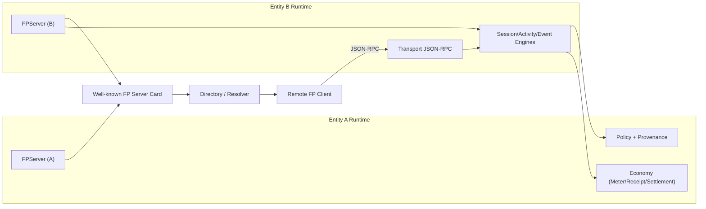

# Foundation Protocol (FP)

FP is a graph-first control plane for multi-entity AI systems.

When your system evolves from a single model endpoint to a coordinated network of agents, tools, services, resources, organizations, and humans, FP provides the shared protocol substrate to keep execution, governance, evidence, and economics coherent.

## TL;DR

FP helps you run AI systems that are:

- **multi-party** (not single-node)
- **stateful** (not one-shot)
- **governed** (not best-effort)
- **auditable** (not log-forensics-only)
- **economically accountable** (not opaque cost centers)

## Is FP right for your system?

Use FP if at least two are true:

- you orchestrate multiple entities in one user-facing workflow
- you need role-based controls for sensitive actions
- you need resumable event streams and explicit state transitions
- you need portable protocol semantics across runtime/framework boundaries
- you need settlement/receipt evidence for billable AI work

FP is not intended as a replacement for model inference APIs or domain-specific app logic. It is the **control plane** around them.

## Architecture at a glance

The diagram shows FP as a **federated control plane**:

- each entity can run and publish its own `FPServer`
- other entities discover published servers through server cards + directory
- collaboration happens through remote FP method calls (`sessions`, `activities`, `events`)
- governance/evidence/economy stay first-class in the same runtime path

This keeps inter-entity coordination simple without sacrificing policy, auditability, or settlement semantics.

## What FP gives each stakeholder

| Role | Immediate value |
| --- | --- |
| Platform engineer | one semantic model for entities/sessions/activities/events |
| Agent framework team | stable runtime contract for orchestration and recovery |
| Governance/compliance | policy decisions and provenance records as first-class outputs |
| Product engineer | reusable collaboration primitives instead of bespoke glue |
| Ops/FinOps | token/cost metering plus receipt/settlement artifacts |

## Capability map

### 1) Collaboration substrate

- entity registry
- organization + membership + role semantics
- session containers with participants, policy, budget
- activity state machine with deterministic transitions

### 2) Runtime reliability

- idempotent write retries with fingerprint conflict detection
- event stream replay + resubscribe + ack
- stream backpressure control
- explicit semantic error model (`FP_*` codes)

### 3) Governance and evidence

- policy hooks for pre-invoke / role-change / settlement checks
- allow/deny decisions persisted as provenance records
- audit bundle export for timeline reconstruction

### 4) Economy primitives

- meter records for usage attribution
- signed receipts for execution evidence
- settlement lifecycle and dispute objects

### 5) Integration surface

- quickstart APIs for rapid adoption
- app-layer server/client APIs for production wiring
- JSON-RPC dispatcher for service-facing protocol endpoints
- publish/discover/connect primitives for federated FP servers

## End-to-end control-plane loop

1. Register entities.
2. Create session with participants and roles.
3. Start activity (policy checks + idempotency semantics).
4. Stream events and ack consumption.
5. Complete activity and capture usage/cost evidence.
6. Issue receipt and settlement artifacts if required.
7. Export audit bundle for governance/reporting.

## Example outcomes you can implement

- planner agent coordinating tools and UI entities in one governed session
- approval-gated financial operation with explicit denial/approval evidence
- provider/buyer service workflow with receipt verification and settlement confirmation
- market-style resource allocation with event ordering and economic attestation
- cross-organization discovery where entities publish their own FP servers and collaborate over network calls

Runnable scenario set: [Examples](examples.md)

## 15-minute first value path

1. Follow [Getting Started](getting-started.md) and run baseline example.
2. Execute all scenario examples: `bash scripts/run_examples.sh`.
3. Run quality gate: `bash scripts/quality_gate.sh`.
4. Review [White Paper Alignment](whitepaper-alignment.md).
5. Inspect API entry points in [API Reference](api.md).

## Engineering posture

FP runtime is designed with high signal-to-noise semantics:

- strict invariants over permissive ambiguity
- compact, transport-safe data shapes
- progressive disclosure and reference-oriented payloads
- extension-friendly architecture without core semantic drift

## Current maturity

- Version: `0.1.0`
- Runtime style: in-memory-first reference runtime with federated publish/discovery support
- Documentation: MkDocs + API docs + runnable scenario coverage
- CI: quality gate workflow + docs deployment workflow

## Navigation

- **Start now**: [Getting Started](getting-started.md)
- **See architecture boundaries (Mermaid + ASCII diagrams)**: [Architecture](architecture.md)
- **Validate white-paper intent**: [White Paper Alignment](whitepaper-alignment.md)
- **Run real scenarios**: [Examples](examples.md)
- **Check release checklist**: [Release Readiness](release-readiness.md)
- **Browse full API surface**: [API Reference](api.md)
